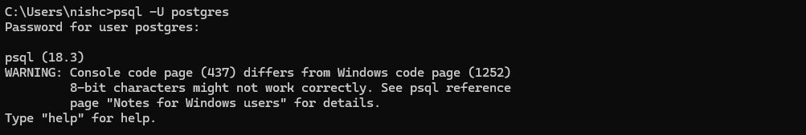
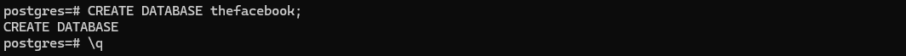
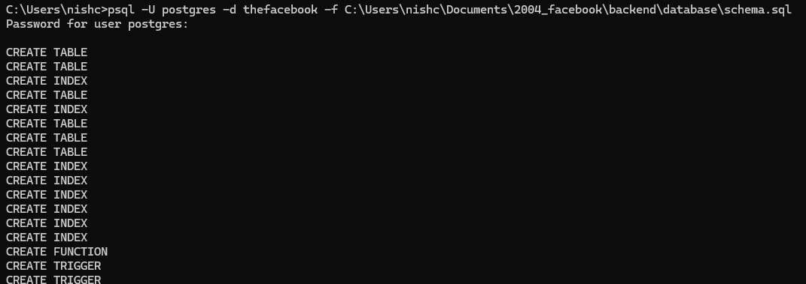
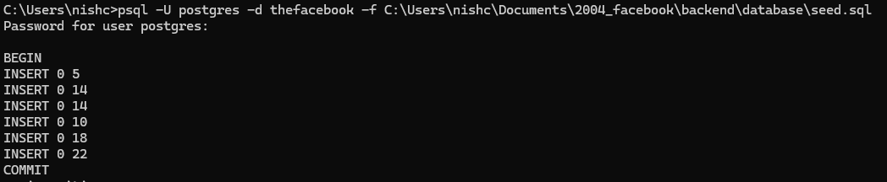
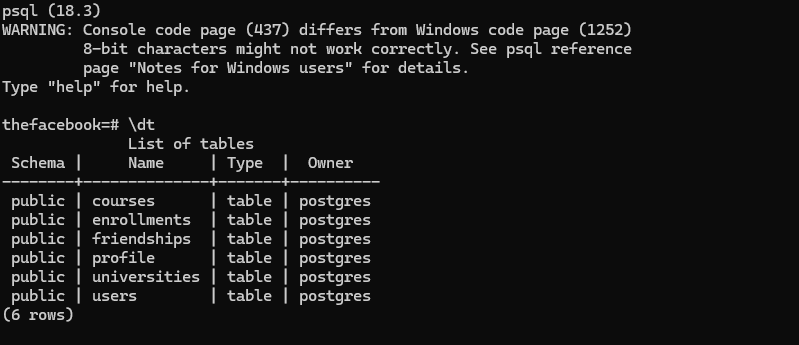
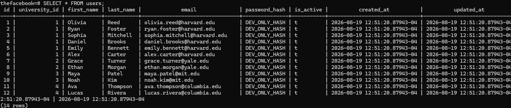

# 1) write the queries schema.sql , seed.sql 

# 2) open your terminal and start postgres server 

# 3) create a database named thefacebook then exit

# 4) copy your schema.sql file path and add it to database 

# 5) do the same for seed.sql 

# 6) now check your database 

