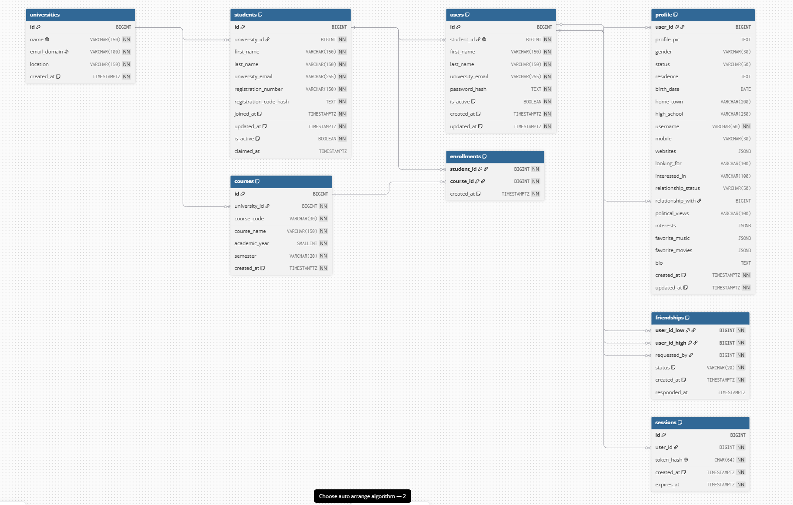

# Thefacebook Database Design



---

## Database Structure

```text

                         universities

                         ┌──────────────┐

                         │ id           │

                         │ name         │

                         │ email_domain │

                         └──────┬───────┘

                                │

                  ┌─────────────┴─────────────┐

                  │                           │

                  ▼                           ▼

              students                    courses

       ┌────────────────────┐       ┌─────────────────┐

       │ id                 │       │ id              │

       │ university_id      │       │ university_id   │

       │ first_name         │       │ course_code     │

       │ last_name          │       │ course_name     │

       │ university_email   │       │ academic_year   │

       │ registration_number│       │ semester        │

       │ registration_code  │       └────────┬────────┘

       │ claimed_at         │                │

       └─────────┬──────────┘                │

                 │                           │

        ┌────────┴────────────┐              │

        │                     │              │

        ▼                     └────── enrollments

      users                            ▲

┌─────────────────┐                   │

│ id              │                   │

│ student_id      │───────────────────┘

│ first_name      │

│ last_name       │

│ university_email│

│ password_hash   │

└────────┬────────┘

         │

┌────────┼────────────┐

│        │            │

▼        ▼            ▼

profile friendships sessions

```

---

# Tables

* `universities`

* `students`

* `users`

* `profile`

* `friendships`

* `courses`

* `enrollments`

* `sessions`

---

# Relationships

## 1 to 1

* user -> profile

* student -> user

## 1 to many

* university -> students

* university -> courses

* user -> sessions

* user -> relationship_with

## Many to many

* student <-> enrollments <-> course

* user <-> friendship

---

# University Student Design

* `students` represents students enrolled through the fake university system.

* Each student belongs to one university.

* Each student gets:

  * `university_email`

  * `registration_number`

  * `registration_code`

* The registration code is stored as:

  * `registration_code_hash`

* `claimed_at` is `NULL` before the student creates a Thefacebook account.

* After the student successfully registers:

```text

claimed_at = NOW()

```

* `users.student_id` is unique.

* This prevents one university student from creating more than one Thefacebook account.

---

# Friendship Design

`user_id_low` : smaller user id

`user_id_high` : bigger user id

`chk_friend_order` : low < high

### Reason

```text

user_low = 4

user_high = 7

```

### Friendship table

Without the rule:

| user_id_low | user_id_high | Meaning         |
| ----------: | -----------: | --------------- |
|           4 |            7 | 4 friend with 7 |
|           7 |            4 | 7 friend with 4 |

Same friendship stored twice.

So we will only store once when high > low.

| Friendship      | Check   | Result               |
| --------------- | ------- | -------------------- |
| 4 friend with 7 | `4 < 7` | True -> store        |
| 7 friend with 4 | `7 < 4` | False -> don't store |

So the database stores only:

| user_id_low | user_id_high |
| ----------: | -----------: |
|           4 |            7 |

`requested_by` = low or high

`status` = accepted or rejected or pending

---

## Enrollment Design

* `enrollments` is a junction table between students and courses.

* Uses:

  * `student_id`

  * `course_id`

* Composite primary key:

  * `(student_id, course_id)`

* This prevents the same student from enrolling in the same course twice.

* Course enrollment belongs to the university student because the student selects courses before creating a Thefacebook account.

---

# Session Design

* `sessions` stores authenticated user sessions.

* After registration or login:

```text

generate random session token

        ↓

SHA-256(token)

        ↓

store token_hash in sessions

```

* The raw session token is stored in the browser cookie.

* The hashed token is stored in the database.

```text

Browser

   │

   │ session cookie

   ▼

FastAPI

   │

   │ SHA-256(cookie)

   ▼

sessions

   │

   │ user_id

   ▼

users

```

* On logout:

```text

delete session

+

delete browser cookie

```

---


# Indexes

All are default B-tree indexes as we may need to do queries like `=`, `>`, `<`, etc.

| Index                     | Purpose                                             |
| ------------------------- | --------------------------------------------------- |
| `uq_students_email_lower` | case-insensitive unique student email               |
| `uq_users_email_lower`    | case-insensitive unique Facebook login email        |
| `idx_students_university` | search students from university                     |
| `idx_students_name`       | search students by last name + first name           |
| `idx_users_name`          | search by last name + first name                    |
| `idx_enrollments_course`  | search students enrolled in a course                |
| `idx_friendships_low`     | search friendships where the user is `user_id_low`  |
| `idx_friendships_high`    | search friendships where the user is `user_id_high` |
| `idx_courses_university`  | search which courses belong to which university     |
| `idx_sessions_user`       | search sessions from a user                         |
| `idx_sessions_expires_at` | search expired sessions                             |

---

# Functions

* classic updated at function. could be done in service too. but done in low level

---

# Triggers

* `trg_students_updated_at` - every time a row is updated on students table trigger the `update_updated_at_column` function

* `trg_users_updated_at` - every time a row is updated on users table trigger the `update_updated_at_column` function

* `trg_profile_updated_at` - every time a row is updated on profile table trigger the `update_updated_at_column` function

---

## Important Things I Learned

* Many-to-many relationships require a junction table.

* A friendship is a self-referencing many-to-many relationship.

* Foreign keys maintain relationships between tables.

* `ON DELETE CASCADE` removes dependent rows automatically.

* `ON DELETE RESTRICT` prevents deleting a referenced parent row.

* Composite primary keys are useful when the relationship itself uniquely identifies a row.

* Avoid storing redundant foreign keys when the relationship can already be derived through another table.

* `DEFAULT NOW()` only sets the timestamp during INSERT.

  * A trigger is needed if `updated_at` should change automatically on UPDATE.

* Indexes should be created around actual query patterns, not added randomly.

* A university student can exist before creating a Thefacebook account.

* A one-to-zero-or-one relationship can be enforced using a unique foreign key.

* `users.student_id` is unique, so one student can have at most one Thefacebook account.

* University verification is only needed during registration.

* After registration, login uses the `users` table.

* One-time registration codes should not remain reusable after registration.

* Sensitive authentication values should not be stored in plain text.

* Server-side sessions map a random browser cookie token to a user on the backend.

* Course enrollment belongs to students rather than Facebook users because the enrollment exists before the Facebook account.

* University information does not need to be stored again in `users` because it can be derived through:

```text

users

  ↓

students

  ↓

universities

```
