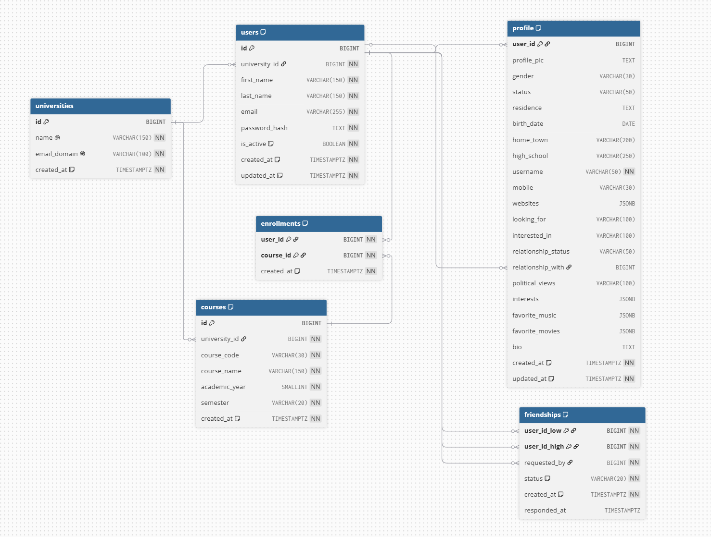

# Thefacebook Database Design



---

## Database Structure

```text
                         universities
                         ┌──────────────┐
                         │ id           │
                         │ name         │
                         │ email_domain │
                         └──────┬───────┘
                                │
                  ┌─────────────┴─────────────┐
                  │                           │
                  ▼                           ▼
              users                       courses
       ┌─────────────────┐         ┌─────────────────┐
       │ id              │         │ id              │
       │ university_id   │         │ university_id   │
       │ first_name      │         │ course_code     │
       │ last_name       │         │ course_name     │
       │ email           │         │ academic_year   │
       │ password_hash   │         │ semester        │
       └────────┬────────┘         └────────┬────────┘
                │                           │
       ┌────────┼────────────┐              │
       │        │            │              │
       ▼        ▼            ▼              ▼
    profile friendships       └────── enrollments
       │                            ▲
       │                            │
       └────────────────────────────┘
```

---

# Tables

* `universities`
* `users`
* `profile`
* `friendships`
* `courses`
* `enrollments`

---

# Relationships

## 1 to 1

* user -> profile

## 1 to many

* university -> users
* university -> courses
* user -> relationship_with

## Many to many

* user <-> enrollments <-> course
* user <-> friendship

---

# Friendship Design

`user_id_low` : smaller user id
`user_id_high` : bigger user id

`chk_friend_order` : low < high

### Reason

```text
user_low = 4
user_high = 7
```

### Friendship table

Without the rule:

| user_id_low | user_id_high | Meaning         |
| ----------: | -----------: | --------------- |
|           4 |            7 | 4 friend with 7 |
|           7 |            4 | 7 friend with 4 |

Same friendship stored twice.

So we will only store once when high > low.

| Friendship      | Check   | Result               |
| --------------- | ------- | -------------------- |
| 4 friend with 7 | `4 < 7` | True -> store        |
| 7 friend with 4 | `7 < 4` | False -> don't store |

So the database stores only:

| user_id_low | user_id_high |
| ----------: | -----------: |
|           4 |            7 |

`requested_by` = low or high
`status` = accepted or rejected or pending

---

## Enrollment Design

* `enrollments` is a junction table between users and courses.

* Uses:

  * `user_id`
  * `course_id`

* Composite primary key:

  * `(user_id, course_id)`

* This prevents the same user from enrolling in the same course twice.

---

# Indexes

All are default B-tree indexes as we may need to do queries like `=`, `>`, `<`, etc.

| Index                    | Purpose                                             |
| ------------------------ | --------------------------------------------------- |
| `idx_users_university`   | search users from university                        |
| `idx_users_name`         | search by last name + first name                    |
| `idx_enrollments_course` | search users enrolled in a course                   |
| `idx_friendships_low`    | search friendships where the user is `user_id_low`  |
| `idx_friendships_high`   | search friendships where the user is `user_id_high` |
| `idx_courses_university` | search which courses belong to which university     |

---

# Functions

* classic updated at function. could be done in service too. but done in low level

---

# Triggers

* `trg_users_updated_at` - every time a row is updated on users table trigger the `update_updated_at_column` function

* `trg_profile_updated_at` - every time a row is updated on profile table trigger the `update_updated_at_column` function

---

## Important Things I Learned

* Many-to-many relationships require a junction table.

* A friendship is a self-referencing many-to-many relationship.

* Foreign keys maintain relationships between tables.

* `ON DELETE CASCADE` removes dependent rows automatically.

* `ON DELETE RESTRICT` prevents deleting a referenced parent row.

* Composite primary keys are useful when the relationship itself uniquely identifies a row.

* Avoid storing redundant foreign keys when the relationship can already be derived through another table.

* `DEFAULT NOW()` only sets the timestamp during INSERT.

  * A trigger is needed if `updated_at` should change automatically on UPDATE.

* Indexes should be created around actual query patterns, not added randomly.
