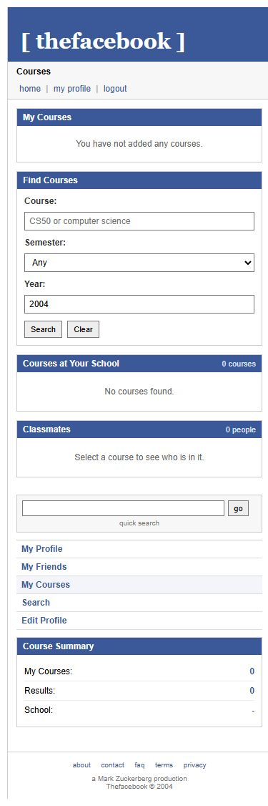

# Courses Flow

Courses let a student see classes at their university and find classmates.

The page is:

```text
frontend/courses.html
```

The routes start at:

```text
/courses
```

---

## Latest main checked

This work started from current local `main`.

Important commit:

```text
101ba00 abort fix 2: added gitignore
```

Important files:

```text
frontend/courses.html
frontend/scripts/courses.js
frontend/styles/courses.css
backend/app/router/courses.py
backend/app/service/courses.py
backend/app/schema/courses.py
backend/tests/test_courses.py
```

---

## Course Page

The page has three main pieces:

```text
My Courses
Find Courses
Classmates
```


The same page also stacks cleanly on mobile:



User flow:

```text
open courses page
        |
        v
load my courses
        |
        v
load course catalog for my school
        |
        v
add or drop courses
        |
        v
click classmates
```

---

## Backend Routes

Routes:

```text
GET /courses
GET /courses/mine
GET /courses/{course_id}/students
POST /courses/{course_id}/enroll
DELETE /courses/{course_id}/enroll
```

The route always starts from the session cookie:

```text
cookie
    |
    v
current_user_id
    |
    v
student_id + university_id
```

That means a logged-in Harvard student only sees Harvard courses.

---

## Course Search

The search route accepts:

```text
q
semester
academic_year
```

Example:

```text
GET /courses?q=CS&semester=fall&academic_year=2004
```

The backend reads:

```text
courses
universities
enrollments
```

It returns:

```text
course_id
course_code
course_name
university_name
academic_year
semester
enrollment_count
is_enrolled
```

`is_enrolled` lets the frontend choose:

```text
Add Course
```

or:

```text
Added + Drop
```

---

## Enrolling

Route:

```text
POST /courses/{course_id}/enroll
```

Flow:

```text
click Add Course
        |
        v
backend checks course belongs to my university
        |
        v
INSERT INTO enrollments
        |
        v
ON CONFLICT DO NOTHING
```

`ON CONFLICT DO NOTHING` means clicking twice will not create duplicate
enrollment rows.

---

## Classmates

Route:

```text
GET /courses/{course_id}/students
```

This shows students enrolled in that course.

The response also includes friendship state:

```text
self
none
pending_sent
pending_received
accepted
```

So classmates can show:

```text
This is You
Add Friend
Requested
Pending
Friends
```

That connects courses back to friends.

---

## Homepage

The homepage now loads:

```text
GET /courses/mine
```

and fills the `My Courses` box with real enrolled courses.

So the homepage is no longer just saying:

```text
You have not added any courses.
```

when courses exist.

---

## Test I Ran

Tests:

```text
backend/tests/test_courses.py
```

Command:

```text
python -B -m pytest tests/test_courses.py tests/test_search.py tests/test_friendship_status.py tests/test_profile_creation.py -v -p no:cacheprovider
```

Result:

```text
15 passed
```

The course tests check:

```text
course catalog stays scoped to the current university
search filters are sent into SQL
enroll inserts the current student/course pair
classmates return friendship state
classmates return looking_for and relationship_status
```

---

## Things I learned

- Courses belong to universities.
- Enrollments belong to students, not directly to users.
- The logged-in user has to be converted into a student row first.
- A course page is more useful when it connects to classmates.
- Course classmates should reuse the same friendship labels as the rest of the app.

---

[<- Back to Index](./README.md)
