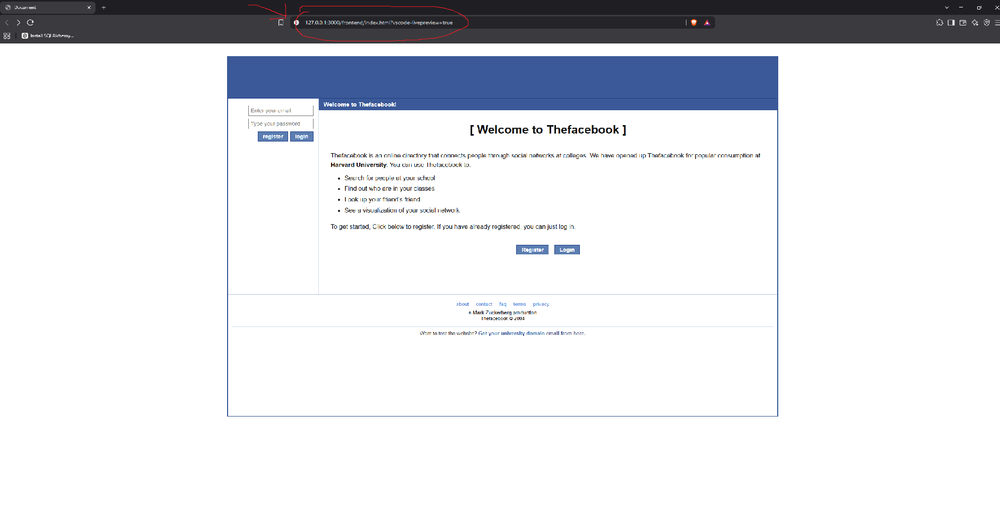
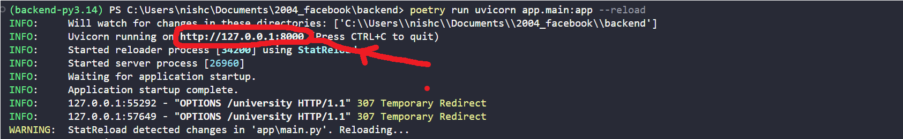

# Backend

For backend connection to frontend we first need the frontend server. from my localhost i can see its

`http://127.0.0.1:3000/`

or we can write is as

`http://localhost:3000/`



Also lets collect the backend server. as my server is fastapi server and i explicitly didnt change the port it should be

`http://127.0.0.1:8000`

or you can check your terminal after starting the fastapi server



### Servers

```text
frontend server : http://127.0.0.1:3000/
backend server  : http://127.0.0.1:8000
```

---

## CORS Middleware

now go to `main.py` add CORS middleware to connect frontend server

```python
from fastapi.middleware.cors import CORSMiddleware


app.add_middleware(
    CORSMiddleware,
    allow_origins=[
        "http://127.0.0.1:3000",    ## frontend server
        "http://localhost:3000",
    ],
    allow_credentials=True,
    allow_methods=["*"],
    allow_headers=["*"],
)
```

CORS tells the backend which frontend server is allowed to make requests to it.

Here our frontend is running on port `3000` and FastAPI is running on port `8000`.

```text
Frontend
http://127.0.0.1:3000
        |
        | request
        v
Backend
http://127.0.0.1:8000
```

---

## Fetch Backend From JavaScript

For this project wherever you are using js for functionality fetch the backend server

```javascript
const response = await fetch(
    "http://127.0.0.1:8000/university",
    {
        method: "POST",

        headers: {
            "Content-Type": "application/json"
        },

        body: JSON.stringify(credentials)
    }
);
```

varies for methods.

For example:

```text
GET     -> get data
POST    -> create data
PUT     -> replace data
PATCH   -> update data
DELETE  -> delete data
```

The endpoint also changes depending on what backend functionality we want.

```text
http://127.0.0.1:8000/university
http://127.0.0.1:8000/register
http://127.0.0.1:8000/login
http://127.0.0.1:8000/logout
```

---

# Replacement in Production

in production we will not use localhost.

Instead of:

```text
frontend server : http://127.0.0.1:3000
backend server  : http://127.0.0.1:8000
```

we will have real deployed domains.

example:

```text
frontend server : https://thefacebook.com
backend server  : https://api.thefacebook.com
```

Then CORS will become:

```python
app.add_middleware(
    CORSMiddleware,
    allow_origins=[
        "https://thefacebook.com",
    ],
    allow_credentials=True,
    allow_methods=["*"],
    allow_headers=["*"],
)
```

And JavaScript will fetch the production backend:

```javascript
const response = await fetch(
    "https://api.thefacebook.com/university",
    {
        method: "POST",

        headers: {
            "Content-Type": "application/json"
        },

        body: JSON.stringify(credentials)
    }
);
```

Instead of hardcoding the backend URL everywhere, later we can keep it in one place.

```javascript
const API_URL = "http://127.0.0.1:8000";
```

Then:

```javascript
const response = await fetch(
    `${API_URL}/university`,
    {
        method: "POST",

        headers: {
            "Content-Type": "application/json"
        },

        body: JSON.stringify(credentials)
    }
);
```

During development:

```text
API_URL = http://127.0.0.1:8000
```

During production:

```text
API_URL = https://api.thefacebook.com
```

So we only change the backend server URL in one place instead of changing every `fetch()` call.


---

[← Back to Index](./README.md)